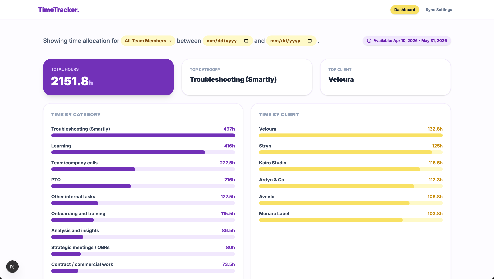
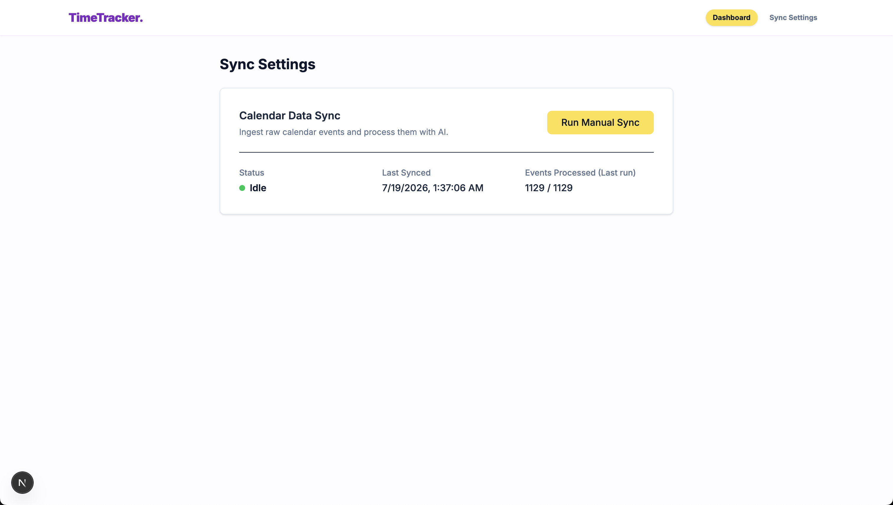

# Time-Tracking Dashboard MVP

A full-stack MVP application built for internal Operations/Customer Success teams to track time allocation per category and per client. The system ingests raw Google Calendar events and uses a custom AI Proxy to accurately classify each event into one of 15 fixed categories and deduce the associated client.

---

## 🏗️ Architecture Choices

- **Next.js (App Router) + TypeScript**: Provides a robust, unified full-stack environment where the frontend React components and the backend API routes share the exact same strict TypeScript definitions.
- **SQLite + Prisma**: Perfect for a local-first MVP. The database is stored locally in a portable `.db` file, requiring zero external infrastructure setup. The schema strongly types our `Employee`, `Company`, `Event`, and `ProcessedEvent` models.
- **Tailwind CSS**: Utility-first styling approach matching the internal color palette requirements quickly and cleanly without the bloat of heavy component libraries.
- **Database-as-Cache Pattern**: To ensure the dashboard always loads instantly regardless of dataset size, the frontend exclusively reads pre-aggregated stats from the `ProcessedEvent` table. The dashboard never triggers external API or AI calls on load. Syncing is explicitly decoupled and runs asynchronously.
- **Data Ingestion Resiliency**: To safely extract bulk data from the Calendar/Resources API without triggering rate limits, the synchronization engine is highly controlled. It iterates through every employee, fetching events where they are an `attendee` and then where they are a `creator`. Data is fetched in pages of 50 with built-in network retries and a strict 0.3-second "polite delay" between page requests. Records are then safely `upserted` into SQLite to prevent duplication.
- **AI Proxy Batching & Retries**: Calendar processing relies on an LLM proxy. To prevent overwhelming it, events are processed in configurable batch sizes (default=1). The engine utilizes an exponential backoff retry system (up to 5 attempts on failure) and enforces a hard 0.5-second delay between every batch to strictly respect external rate limits.
- **Smart Sync & Deduplication**: To prevent redundant processing, the background sync explicitly filters out events that have already been classified by querying the database (`WHERE id NOT IN...`). Triggering a manual sync multiple times is completely safe and will skip over already-processed events instantly.
- **Cost-Optimized AI Fan-Out**: Each unique calendar event is sent to the LLM exactly **once**, regardless of how many employees attended it. Once the AI determines the category and client, that single classification is "fanned out" (copied) into the `ProcessedEvent` table for each internal attendee. This ensures massive API cost savings and drastic reductions in token usage.

## 🤖 AI Prompt & Output Strategy

To enforce the fixed list of 15 categories and valid client deductions, the AI prompt is highly structured:
1. **Schema Enforcement**: The proxy uses a rigid JSON schema (`output_schema`) defining exactly 3 properties: `category`, `client_name`, `client_id`. The `category` is an explicit Enum.
2. **Context Passing**: We pass the localized `known_companies` list so the LLM can cross-reference email domains and mentioned company names accurately, significantly reducing hallucinations.
3. **Database Validation**: Even after the LLM returns a client ID, our backend explicitly validates that ID against the `Company` table before writing it. If it hallucinated or failed to find a client (e.g., for internal tasks or PTO), it stores `null`.

---

## 🚀 Getting Started

Follow these instructions to run the application locally.

### 1. Install Dependencies
```bash
npm install
```

### 2. Setup Environment Variables
Copy the example environment file and fill in your actual credentials (the external API and proxy keys).
```bash
cp .env.example .env
```

**Note on Secrets Management:** 
The application securely resolves environment variables dynamically. It accepts two formats for credentials:
1. **Raw Credentials**: Perfect for local testing (e.g., `AI_PROXY_API_KEY="sk-12345"`).
2. **AWS SSM Paths**: For production, simply provide the path (e.g., `AI_PROXY_API_KEY="/timetracker/AI_PROXY_API_KEY"`), and the app will automatically decrypt it from the AWS Parameter Store at runtime.

Ensure your `.env` contains:
- `DATABASE_URL="file:./dev.db"`
- `RESOURCES_API_KEY="your_api_key"`
- `AI_PROXY_URL="https://fasttrack-2-1035702834144.europe-west1.run.app/api/ai-proxy/structured"`
- `AI_PROXY_EMAIL="your_auth_email"`
- `AI_PROXY_API_KEY="your_ai_proxy_password"`
- `AI_PROXY_BATCH_SIZE="1"`

### 3. Initialize the Database
Run the Prisma migration to create the SQLite database:
```bash
npx prisma migrate dev --name init
```
*(The real employees, clients, and events will be fetched and saved during the first background sync)*

### 4. Run the Development Server
```bash
npm run dev
```
Open [http://localhost:3000](http://localhost:3000) in your browser.

---

## 🧪 Testing and Validation

The application utilizes the native Node.js test runner for basic validations. The test suite and validation reports confirm that all MVP constraints have been met, including the strict TypeScript and SQLite constraints.
```bash
npm run test
npm run lint
npx tsc --noEmit
```

---

## 📸 Application Previews

Here is a quick look at the finalized dashboard visualizing the processed calendar events:



And here is the background sync interface where you manage data ingestion:

